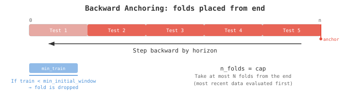
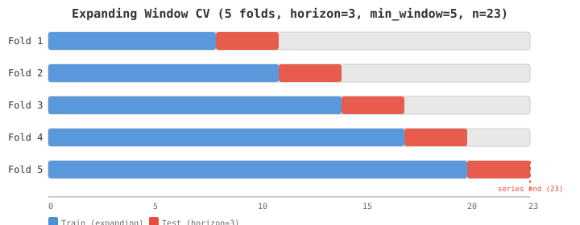
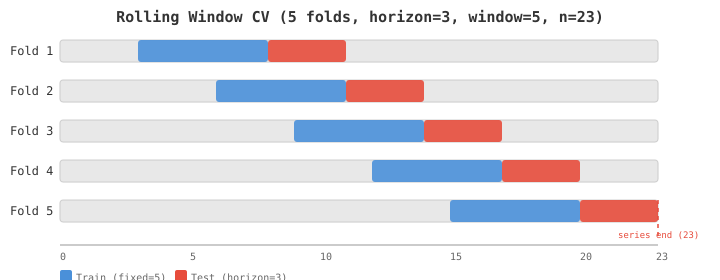
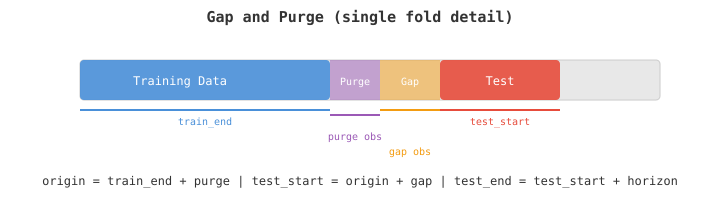
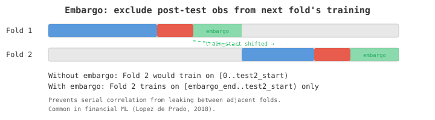

# Time Series Cross-Validation

Time series data is ordered in time, so standard k-fold cross-validation (which shuffles data randomly) is invalid — it leaks future information into the training set. Time series CV respects temporal ordering: every training set contains only observations that occurred *before* the test set.

## How It Works

Folds are placed **backwards from the series end**, stepping back by `horizon` (the forecast length). The last fold's test window always reaches the series end. This ensures the most recent data — typically the most relevant — is always evaluated.



### Parameters

| Parameter | Description | Default |
|-----------|-------------|---------|
| `n_folds` | Maximum number of folds to generate | 5 |
| `horizon` | Test window size (forecast length) per fold | 1 |
| `min_initial_window` | Minimum training observations (constraint) | 10 |
| `step_size` | Step between fold origins | `horizon` |
| `strategy` | `Expanding` or `Rolling` | `Expanding` |
| `gap` | Observations excluded between train and test | 0 |
| `purge` | Observations removed from training end | 0 |
| `embargo` | Post-test observations excluded from next fold | 0 |

### Algorithm

```
1. Anchor last fold: last_origin = series_len - gap - horizon
2. Step backwards:   origin -= step_size  (repeat)
3. Stop when:        train_size < min_initial_window
4. Cap at n_folds:   keep only the most recent N folds
```

## Expanding Window

Training always starts at index 0 and grows with each fold. Earlier folds have less data; later folds have more. This maximizes the use of available data.



```rust
use anofox_forecast::utils::cross_validation::{CvFoldGenerator, CVStrategy};

let folds = CvFoldGenerator::new()
    .n_folds(5)
    .horizon(12)
    .min_initial_window(50)
    .strategy(CVStrategy::Expanding)
    .generate(200)
    .unwrap();

// Fold 1: train=[0..  50), test=[ 50.. 62)   — smallest training set
// Fold 2: train=[0..  62), test=[ 62.. 74)
// ...
// Fold 5: train=[0.. 188), test=[188..200)   — largest training set, anchored at end
```

**When to use**: Default choice. Works well when the data-generating process is relatively stable over time.

## Rolling Window

Training window has a **fixed size** equal to `min_initial_window`. As folds advance, the window slides forward — old observations drop off the front while new ones enter from the back.



```rust
let folds = CvFoldGenerator::new()
    .n_folds(5)
    .horizon(12)
    .min_initial_window(50)
    .strategy(CVStrategy::Rolling)
    .generate(200)
    .unwrap();

// Every fold: train_size = 50 (fixed)
// Fold 1: train=[  2.. 52), test=[ 52.. 64)
// Fold 2: train=[ 14.. 64), test=[ 64.. 76)
// ...
// Fold 5: train=[138..188), test=[188..200)
```

**When to use**: When recent data is more relevant than distant history (concept drift, regime changes, non-stationary processes).

## Step Size

`step_size` controls the spacing between consecutive fold origins. By default it equals `horizon`, giving **contiguous, non-overlapping test sets**.

| step_size vs horizon | Result |
|---------------------|--------|
| `step_size = horizon` (default) | Contiguous test sets, no gaps or overlap |
| `step_size < horizon` | Overlapping test sets (more folds, correlated errors) |
| `step_size > horizon` | Gaps between test sets (fewer folds, faster) |

```rust
// Overlapping test windows (step=1, horizon=5)
let folds = CvFoldGenerator::new()
    .n_folds(20)
    .horizon(5)
    .step_size(1)
    .min_initial_window(50)
    .generate(200)
    .unwrap();
```

## Gap and Purge

**Gap** excludes observations between the training end and test start. Use this when your features contain lagged values that could leak test information into training.

**Purge** removes observations from the end of the training set. Use this in financial ML where label formation windows overlap (e.g., a 10-day forward return label computed at time t uses data from t+1 to t+10).



```rust
let folds = CvFoldGenerator::new()
    .n_folds(5)
    .horizon(12)
    .min_initial_window(50)
    .gap(3)     // 3 observations excluded between train and test
    .purge(2)   // 2 observations removed from training end
    .generate(200)
    .unwrap();

// For each fold:
//   train_end = origin - purge
//   test_start = origin + gap
//   Separation between train and test = purge + gap
```

## Embargo

Embargo excludes observations **after** each test set from the next fold's training set. This prevents serial correlation from leaking across adjacent folds.



```rust
let folds = CvFoldGenerator::new()
    .n_folds(5)
    .horizon(5)
    .min_initial_window(20)
    .embargo(10)
    .generate(200)
    .unwrap();

// Fold 1: test=[...], embargo zone after test
// Fold 2: train_start shifted past embargo zone
```

**When to use**: Financial time series where autocorrelation persists beyond the test window. From Lopez de Prado, *Advances in Financial Machine Learning* (2018).

## Constraint Violation

When `min_initial_window` cannot be satisfied for all requested folds:

```rust
use anofox_forecast::utils::cross_validation::ConstraintViolation;

// Default: return an error
let result = CvFoldGenerator::new()
    .n_folds(10)
    .horizon(5)
    .min_initial_window(100)
    .generate(50);  // Err: need at least 105

// Alternative: silently drop early folds
let folds = CvFoldGenerator::new()
    .n_folds(10)
    .horizon(5)
    .min_initial_window(100)
    .on_constraint_violation(ConstraintViolation::ReduceFolds)
    .generate(200)
    .unwrap();
// Returns fewer than 10 folds — only those with train_size >= 100
```

## Higher-Level API

For common workflows, `CVConfig` + `cross_validate()` wraps the fold generator and runs models:

```rust
use anofox_forecast::utils::cross_validation::{cross_validate, CVConfig};
use anofox_forecast::models::arima::ARIMA;

let config = CVConfig::expanding(50, 12)  // min_initial_window=50, horizon=12
    .with_seasonal_period(12);            // for MASE calculation

let results = cross_validate(&config, &ts, || ARIMA::new(1, 1, 1)).unwrap();

println!("Folds: {}", results.n_folds);
println!("MAE:   {:.2} +/- {:.2}", results.aggregated.mae, results.aggregated.mae_std);
println!("RMSE:  {:.2}", results.aggregated.rmse);
```

## References

- Hyndman, R.J., & Athanasopoulos, G. (2021). *Forecasting: Principles and Practice*, 3rd edition. [Section 5.10: Time series cross-validation](https://otexts.com/fpp3/tscv.html).
- Tashman, L.J. (2000). Out-of-sample tests of forecasting accuracy: an analysis and review. *International Journal of Forecasting*, 16(4), 437-450.
- Lopez de Prado, M. (2018). *Advances in Financial Machine Learning*. Wiley. (Purge, embargo, and combinatorial CV for financial data.)
